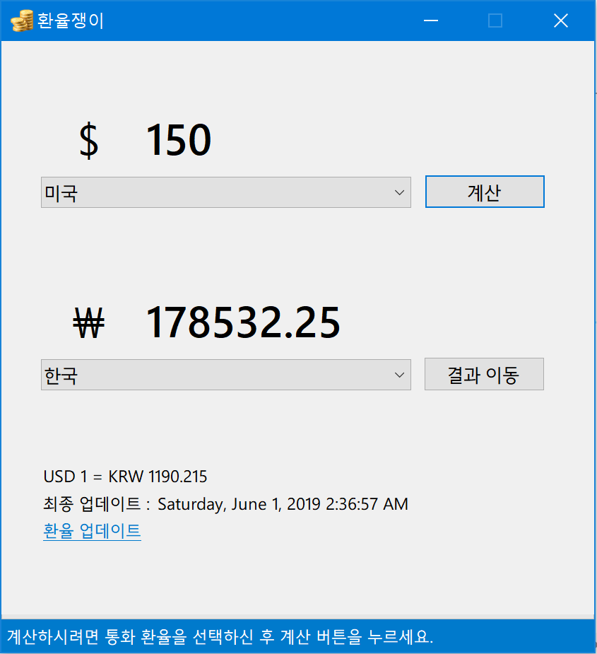

# BingCurrencyConverter
## [Deprecated] Currency converter using the Bing Currency API
Simple currency converter using Bing Currency API (JSON)    

> **[Please note]**  
This project is no longer being maintained, and its not working anymore due to the data that Microsoft uses for the currency converter feature (e.g., in the retail version of the application) is not licensed for 3rd party / individual developer anymore.
 

## Functions
* Currency converter using Bing Currency API (JSON) : Deprecated, as Microsoft announced the data that Microsoft uses for the currency converter feature (e.g., in the retail version of the application) is not licensed for 3rd Parties / Individual Developers use. 
* Converting currencies in an offline conditions.
* Base rate update : 30 mins interval.
* Supports conversion for 109 countries currency.
